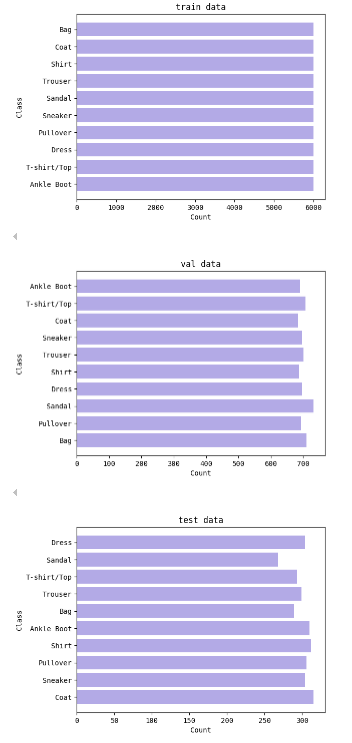
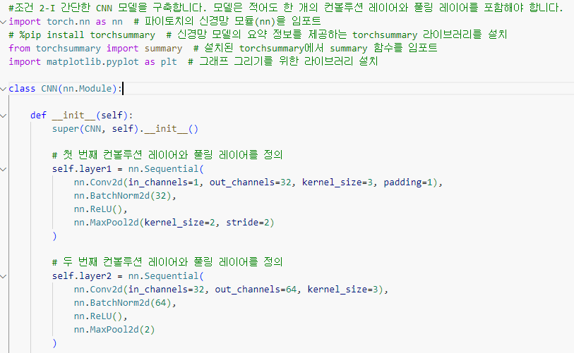
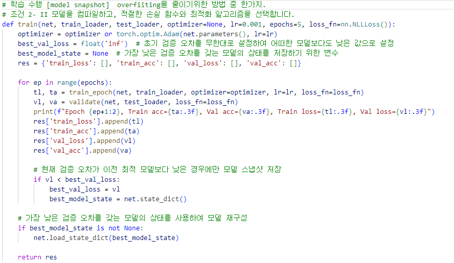
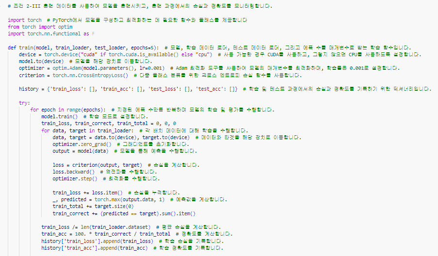
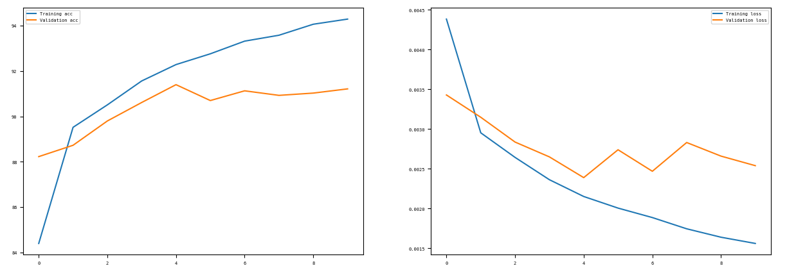
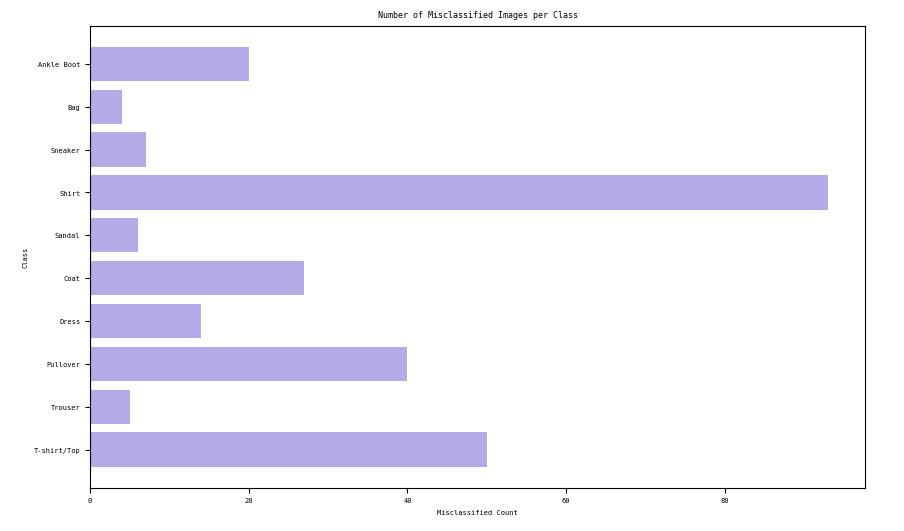
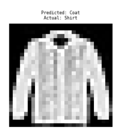
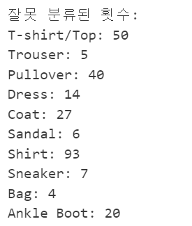

# 중간고사: 컴퓨터 비전 문제

목표: 간단한 컨볼루션 신경망(CNN)을 사용하여 이미지 분류 작업을 수행합니다. 이 과제에서는 Fashion-MNIST 데이터셋을 사용합니다. Pytorch로 구현하세요.

학습관리시스템에 자신의 Python 코드와 데이터 파일이 저장된 github classroom repository link를 제출하시오 (코드는 github codespace에서 실행되어야 함)

과제 마감: 04.25 (목) 10:30

데이터셋:

Fashion-MNIST는 의류와 관련된 이미지로 구성된 데이터셋으로, 각 이미지는 28x28 픽셀의 그레이스케일 이미지입니다. 데이터셋에는 10개의 클래스가 있으며, 각 클래스는 다른 유형의 패션 아이템(예: 티셔츠, 바지, 풀오버, 드레스 등)을 나타냅니다.

과제:

1. 데이터 분석:

I.torchvision module에서 제공하는 FashionMNIST를 활용해야 합니다 (전체 데이터)

II.이미지 데이터의 형태와 클래스 레이블을 시각적으로 탐색하고 분석합니다.

2. 모델 구축 및 훈련:
 
I.간단한 CNN 모델을 구축합니다. 모델은 적어도 한 개의 컨볼루션 레이어와 풀링 레이어를 포함해야 합니다.

II.모델을 컴파일하고, 적절한 손실 함수와 최적화 알고리즘을 선택합니다.

III.훈련 데이터를 사용하여 모델을 훈련시키고, 훈련 과정에서의 손실과 정확도를 모니터링합니다.

3. 모델 평가 및 결과 분석:

I.테스트 데이터셋을 사용하여 모델을 평가하고, 최종 정확도를 보고합니다.

II.잘못 분류된 이미지들을 분석하고, 어떤 클래스가 모델에 의해 가장 잘못 분류되었는지를 식별합니다.

필수 사항:

해결책은 Visial Studo의 Jupyter Notebook에서 구현해야 합니다.

수행하는 단계를 설명하기 위해 코드에 적절한 주석을 달아야 합니다.

모든 플롯과 시각화는 결과 해석과 함께 포함되어야 합니다.
